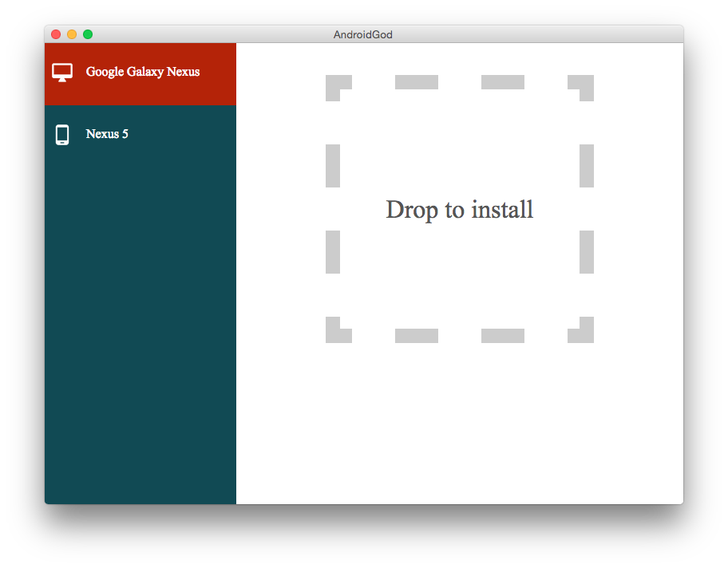

#AndroidGod

Manage your various android device and emulator like a boss.

Because we have so many android devices. if we want to install apk or take a screen shot from one android devices with adb, we have specify device id every time! So i write a GUI tool to simplify the process.
    
#Screenshot
    

#Download

You can download from [release](https://github.com/ufo22940268/AndroidGod/releases/tag/0.1.0) page
    
#TODO

- [ ] Add more functions
- [ ] Package for windows and linux.
